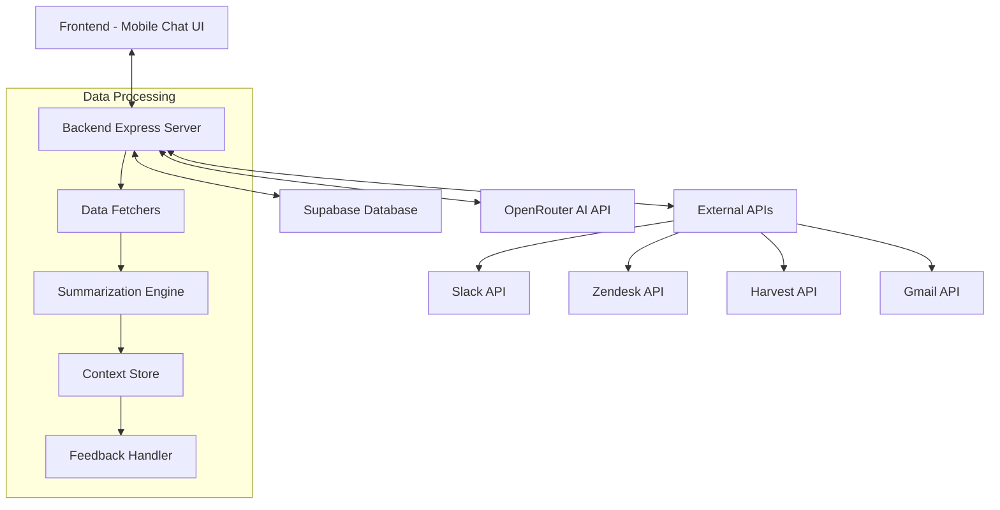
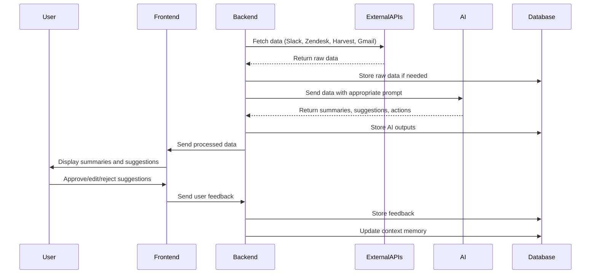
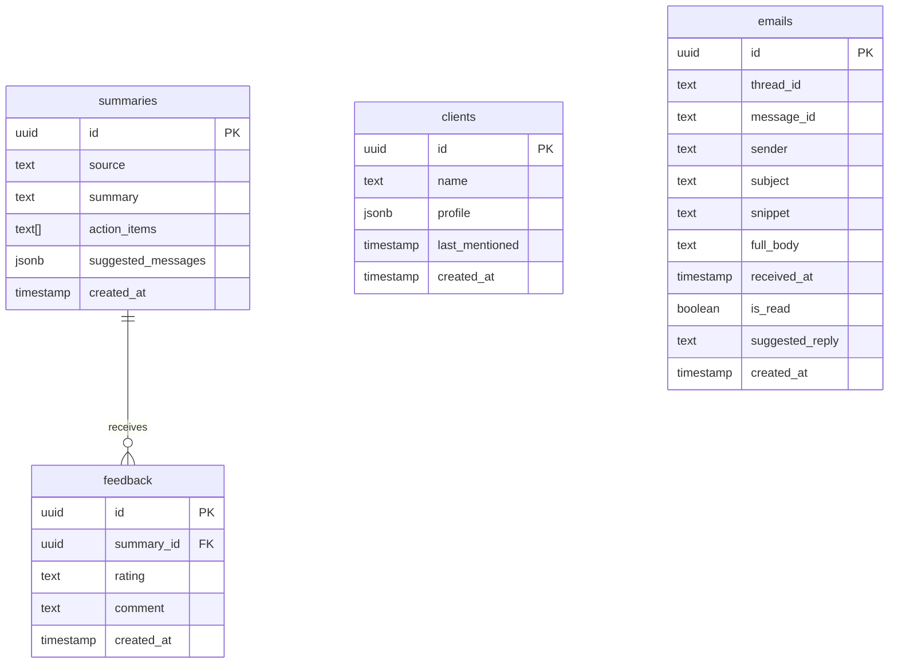
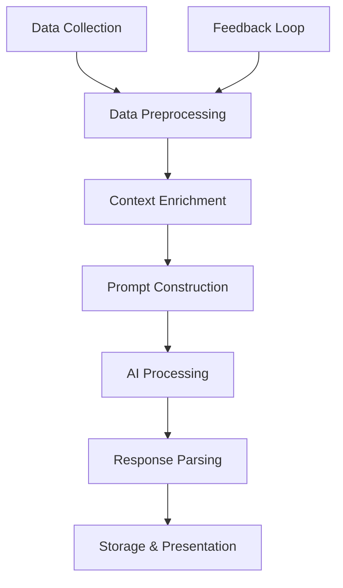
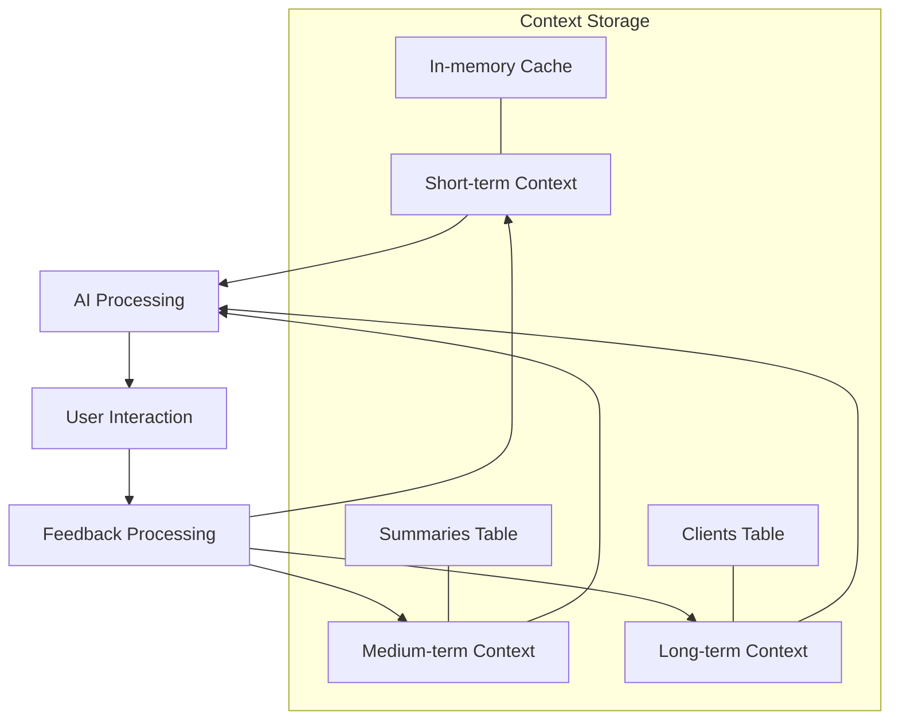

# Stealth AI Ops Assistant - Architectural Overview

This document provides a comprehensive architectural overview of the Stealth AI Ops Assistant MVP, based on analysis of the project structure and requirements.

## Table of Contents

1. [System Components and Interactions](#1-system-components-and-interactions)
2. [Data Flow Between Components](#2-data-flow-between-components)
3. [API Endpoints to Implement](#3-api-endpoints-to-implement)
4. [Database Schema and Usage](#4-database-schema-and-usage)
5. [AI Processing Flow and Context Management](#5-ai-processing-flow-and-context-management)
6. [Technical Considerations and Challenges](#6-technical-considerations-and-challenges)
7. [Implementation Roadmap](#7-implementation-roadmap)

## 1. System Components and Interactions

The system consists of the following major components:

### Component Details:

1. **Frontend**
   - Mobile-first chat interface (`/frontend/pages/chat.tsx`)
   - Message and suggestion components (`/frontend/components/`)
   - Handles user interactions, displays summaries, and manages suggestion approvals/edits

2. **Backend**
   - Express.js server (`/backend/index.js`)
   - Data fetchers for external services (`/backend/routes/fetch*.js`)
   - Summarization engine (`/backend/routes/summarize.js`)
   - Context and memory management (`/backend/memory/`)

3. **Database (Supabase)**
   - Stores summaries, feedback, client context, and emails
   - Implements row-level security for data protection

4. **AI Integration**
   - Uses OpenRouter API to access GPT-4o
   - Processes data through specialized prompts for each data source

5. **External Service Integrations**
   - Slack: Channel messages and threads
   - Zendesk: Support tickets and customer interactions
   - Harvest: Time tracking and invoices
   - Gmail: Email messages and threads

## 2. Data Flow Between Components

### Key Data Flows:

1. **Data Collection Flow**
   - Backend fetchers pull data from external APIs on schedule or demand
   - Raw data is processed and prepared for AI analysis

2. **AI Processing Flow**
   - Data is sent to OpenRouter API with appropriate prompts
   - AI generates summaries, action items, and suggested replies
   - Results are stored in the database

3. **User Interaction Flow**
   - Frontend displays AI-generated content to users
   - Users can approve, edit, or reject suggestions
   - Feedback is stored and used to improve future suggestions

4. **Memory and Context Flow**
   - Client and project context is maintained in the database
   - Historical interactions inform future AI responses
   - Feedback shapes the system's understanding of user preferences

## 3. API Endpoints to Implement

### Backend Routes:

1. **Authentication Endpoints**
   - `POST /auth/login` - Authenticate admin user with token

2. **Data Fetching Endpoints**
   - `GET /api/slack/messages` - Fetch recent Slack messages
   - `GET /api/zendesk/tickets` - Fetch recent Zendesk tickets
   - `GET /api/harvest/time` - Fetch Harvest time entries
   - `GET /api/harvest/invoices` - Fetch Harvest invoices
   - `GET /api/email/messages` - Fetch Gmail messages

3. **Summarization Endpoints**
   - `POST /api/summarize/slack` - Summarize Slack data
   - `POST /api/summarize/zendesk` - Summarize Zendesk data
   - `POST /api/summarize/harvest` - Summarize Harvest data
   - `POST /api/summarize/email` - Summarize email data
   - `POST /api/summarize/all` - Generate comprehensive summary

4. **Interaction Endpoints**
   - `GET /api/summaries` - Get recent summaries
   - `POST /api/feedback` - Submit feedback on suggestions
   - `POST /api/reply/email` - Send approved email reply
   - `POST /api/reply/slack` - Send approved Slack reply
   - `POST /api/reply/zendesk` - Send approved Zendesk reply

5. **Context Management Endpoints**
   - `GET /api/clients` - Get client context information
   - `PUT /api/clients/:id` - Update client context

## 4. Database Schema and Usage

### Supabase Tables:

1. **summaries**
   - Stores AI-generated summaries from different sources
   - Contains action items and suggested messages
   - Used to present information to users and track AI outputs

2. **feedback**
   - Records user responses to AI suggestions (approved, edited, rejected)
   - Links to specific summaries for context
   - Used to improve future AI responses

3. **clients**
   - Maintains client profiles and context
   - Stores when clients were last mentioned
   - Used to provide relevant context to AI for personalized responses

4. **emails**
   - Stores email data including thread information
   - Contains suggested replies for user approval
   - Tracks read status and timestamps

### Schema Relationships:

### Data Access Patterns:

- **Read-Heavy Operations**:
  - Retrieving recent summaries for display
  - Accessing client context for AI processing
  - Fetching suggested replies for user approval

- **Write Operations**:
  - Storing new summaries from AI
  - Recording user feedback
  - Updating client context based on interactions
  - Storing new emails and their suggested replies

## 5. AI Processing Flow and Context Management

### AI Processing Pipeline

#### 1. Data Collection Layer
- **Source-Specific Fetchers**
  - Each external API has a dedicated fetcher (`fetchSlack.js`, `fetchZendesk.js`, etc.)
  - Fetchers handle authentication, pagination, and error handling
  - Data is collected based on configurable time windows (e.g., last 24 hours)

- **Incremental Collection**
  - System tracks last fetch timestamp for each source
  - Only new data is pulled in subsequent fetches
  - Reduces API usage and processing overhead

#### 2. Data Preprocessing Layer
- **Normalization**
  - Converts varied API responses into standardized internal formats
  - Extracts key information (sender, content, timestamp, etc.)
  - Filters irrelevant or noise data

- **Entity Recognition**
  - Identifies mentions of clients, projects, team members
  - Tags content with relevant entities for context linking
  - Prepares data for context enrichment

#### 3. Context Enrichment Layer
- **Client Context Injection**
  - Retrieves relevant client information from `clients` table
  - Includes client history, preferences, and past interactions
  - Adds project-specific context when available

- **Historical Context**
  - Retrieves previous summaries related to current data
  - Includes relevant feedback on past suggestions
  - Provides continuity between interactions

#### 4. Prompt Construction
- **Dynamic Prompt Assembly**
  - Combines base prompts from `/ai/prompts/*.txt` files
  - Injects preprocessed data in structured format
  - Adds relevant context from context enrichment layer

- **Instruction Optimization**
  - Tailors instructions based on source type
  - Includes specific guidance based on past feedback
  - Optimizes token usage while maintaining context richness

#### 5. AI Processing
- **OpenRouter API Integration**
  - Sends assembled prompt to OpenRouter API
  - Uses configured model (default: GPT-4o)
  - Handles API errors and retries

- **Response Streaming**
  - For longer responses, implements streaming to improve UX
  - Processes partial responses as they arrive

#### 6. Response Parsing
- **Structured Output Extraction**
  - Parses AI response into structured components
  - Extracts summaries, action items, suggested replies
  - Validates output against expected schema

- **Confidence Scoring**
  - Assigns confidence levels to suggestions
  - Flags low-confidence items for special handling

#### 7. Storage & Presentation
- **Database Storage**
  - Stores processed results in `summaries` table
  - Links to relevant entities and source data
  - Maintains relationships for context retrieval

- **Frontend Formatting**
  - Prepares data for presentation in chat interface
  - Structures suggestions for easy approval/editing

### Context Maintenance Mechanisms

#### 1. Multi-layered Context System

- **Short-term Context (Session-based)**
  - Maintained in-memory during active sessions
  - Includes recent interactions and temporary state
  - Provides immediate context for ongoing conversations
  - Implemented via `contextStore.js`

- **Medium-term Context (Summary-based)**
  - Stored in `summaries` table
  - Captures recent activities across all platforms
  - Typically spans days to weeks
  - Used to maintain continuity between sessions

- **Long-term Context (Client-based)**
  - Stored in `clients` table as structured profiles
  - Contains persistent information about clients and projects
  - Includes preferences, history, and important notes
  - Provides foundational context for all interactions

#### 2. Context Retrieval Strategies

- **Recency-based Retrieval**
  - Prioritizes recent interactions for immediate context
  - Implements time-decay weighting for relevance
  - Balances recency with relevance

- **Entity-based Retrieval**
  - Links context to specific entities (clients, projects)
  - Retrieves context when entities are mentioned
  - Creates connections between seemingly separate interactions

- **Topic-based Retrieval**
  - Identifies topics and themes across interactions
  - Groups related context regardless of source
  - Provides thematic continuity

#### 3. Feedback Integration System

- **Explicit Feedback Loop**
  - User approvals/edits/rejections stored in `feedback` table
  - Linked to specific summaries and suggestions
  - Used to adjust future prompt construction and context weighting

- **Implicit Feedback Analysis**
  - Tracks patterns in user edits to suggestions
  - Identifies systematic preferences in tone, length, style
  - Gradually adapts system behavior without explicit rules

- **Feedback Memory**
  - Maintains history of feedback patterns
  - Weights recent feedback more heavily
  - Creates personalized interaction style over time

#### 4. Context Pruning and Optimization

- **Token Budget Management**
  - Allocates token budget across different context types
  - Prioritizes most relevant context when budget is limited
  - Implements smart truncation to preserve key information

- **Context Summarization**
  - Periodically condenses older context into summaries
  - Preserves essential information while reducing token usage
  - Creates hierarchical memory structure

- **Relevance Scoring**
  - Assigns relevance scores to context elements
  - Deprioritizes or archives low-relevance context
  - Dynamically adjusts based on user interactions

### Implementation Details

#### Key Files and Their Roles:

- **`/backend/memory/contextStore.js`**
  - Manages retrieval and storage of context
  - Implements context scoring and prioritization
  - Handles context budget allocation

- **`/backend/memory/feedbackHandler.js`**
  - Processes user feedback on suggestions
  - Updates context weights based on feedback
  - Maintains feedback memory for personalization

- **`/backend/routes/summarize.js`**
  - Orchestrates the AI processing pipeline
  - Handles prompt construction with context injection
  - Processes AI responses and structures output

#### Database Interactions:

- **Context Storage Queries**
  - Efficient queries to retrieve relevant context
  - Indexing strategies for performance optimization
  - Caching mechanisms for frequently accessed context

- **Context Update Patterns**
  - Atomic updates to maintain data consistency
  - Batch processing for efficiency
  - Transaction management for related updates

## 6. Technical Considerations and Challenges

### Security Considerations:

1. **Data Privacy**
   - All data is private and accessible only via admin token
   - Supabase Row-Level Security (RLS) restricts access to service role
   - Sensitive API tokens stored in environment variables

2. **Authentication**
   - Simple token-based authentication for MVP
   - Future phases will implement more robust auth systems

### Performance Considerations:

1. **API Rate Limits**
   - External APIs (Slack, Zendesk, Harvest, Gmail) have rate limits
   - Implement request throttling and batching
   - Consider caching frequently accessed data

2. **AI Processing Costs**
   - OpenRouter API calls incur costs based on token usage
   - Optimize prompts and input data to reduce token consumption
   - Implement caching for similar requests

### Scalability Challenges:

1. **Data Volume**
   - Large organizations may generate significant data across platforms
   - Implement pagination and filtering for data fetchers
   - Consider incremental processing for large datasets

2. **Real-time Updates**
   - Users expect timely information
   - Consider implementing webhooks for real-time notifications
   - Balance between real-time updates and system performance

### Integration Challenges:

1. **API Consistency**
   - Each external API has different authentication and data formats
   - Create consistent abstraction layers for each service
   - Handle API changes and versioning gracefully

2. **Context Management**
   - Maintaining relevant context across different data sources
   - Implementing effective memory mechanisms for AI
   - Balancing context richness with token limitations

### Technical Challenges in AI Processing:

#### 1. Context Relevance

**Challenge**: Determining which context is relevant for a given interaction.

**Solution**: 
- Implement relevance scoring based on recency, entity matches, and historical importance
- Use lightweight ML techniques to improve relevance prediction over time
- Allow manual overrides for critical context

#### 2. Token Limitations

**Challenge**: Managing context within token limits of AI models.

**Solution**:
- Implement hierarchical summarization of older context
- Develop smart truncation that preserves key information
- Use separate API calls for context that exceeds token limits

#### 3. Context Consistency

**Challenge**: Maintaining consistent context across different interaction sessions.

**Solution**:
- Implement persistent context storage in database
- Use unique identifiers to link related contexts
- Develop reconciliation mechanisms for conflicting context

#### 4. Performance at Scale

**Challenge**: Maintaining performance as context volume grows.

**Solution**:
- Implement tiered storage with hot/warm/cold context
- Use database indexing optimized for context retrieval patterns
- Develop background processes for context optimization

## 7. Implementation Roadmap

Following the build order outlined in the scaffold document:

1. **Database Setup**
   - Implement Supabase schema using provided SQL files
   - Set up RLS policies and service role access

2. **Backend Implementation**
   - Create Express server with route structure
   - Implement data fetchers for external services
   - Build summarization engine with AI integration

3. **AI Prompt Integration**
   - Implement prompt templates for each data source
   - Create context enrichment mechanisms

4. **Frontend Development**
   - Build mobile-first chat interface
   - Implement suggestion cards and feedback mechanisms

5. **Integration and Testing**
   - Connect frontend to backend
   - Test with sample data from test-data directory
   - Implement feedback and approval workflow